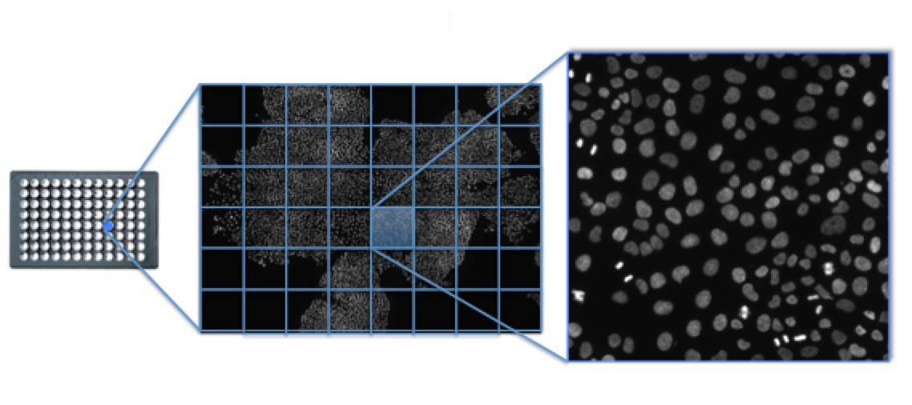

# An Integrated Image data Analysis and Machine Learning approach for high-throughput drug and genetic phenotypic screening

## Goal
The goal of this project is to develop an initial Integrated image data analysis and machine learning  software prototype for high-throughput drug and genetic phenotypic screen. high-throughput phenotypic screening also called  high-content analysis (HCA) or cellomics, is a used in biological research and drug discovery to identify substances such as small molecules, peptides, or RNAi that alter the phenotype of a cell in a desired manner. The most common analysis involves first the labeling proteins with fluorescent tags, then  the acquisition of spatial and temporal  information by an automated microscope, and finally the measurement and analysis of the changes in cell phenotype   using an automated image analysis software. Through the use of fluorescent tags, it is possible to measure in parallel a wide range of cell components and  changes at a subcellular level 

for this project I focuse on quantifying and classifying the spatial heterogeneous effect of drugs and genetic alterations on a large population of cells acquired by using a cell-based in vitro microscopy assay.  “hidden” spatial information are critical in HTS cbecause drug and genetic phenotypic effects on cells strongly depend on cell to cell and cellular spatial interactions. This initaill prototype is structured as a pipeline of separated modules going from image segmentation, data extraction, data management to machine learning classification, statistical analysis and data visualization: 

- [Image segmentation by tasselletion](/Image_Tessellation/README.md) 
- [Data extraction](/2_data_extraction/README.md)
- [Data managment](/3_data_cleaning/README.md)
- Machine learning classification 

TODO
- add a picture of cells with a signal which depends on cell-cell contact inhibiton 
to explain the motivation behind this project

- start to organize the classification 

## Image segmentation by voronoi tassellation

The goal of this part of the project is to segment an image acquisition (Figure 1) in cellular units so that we can calculate the data features for the single cells in the entire cell population. In particularr to determine the cellular units I used a voronoi diagram (Figure 2) on the cell nuclei.  the voronoi diagram is built from a set of points, called seeds, sites or generators, in this project the seeds are the nuclei centrois and for each seed is determned  a corresponding region consisting of all points closer to that seed than to any other. In other words the  regions of a voronoi diagrma , also called Voronoi cells or tassells , are a measure of how close the seed/nucleus of that region is to its neighbours seeds/nuclei. In terms of biology the single tassels of a voronoi diagram gives a mearumented of he level of cell confinement or contact inhibition, which is know to affect many cellular phenotypic effect: proliferation, apoptosis, cell signaling etc. This type of information might be critical to increase the accurancy for example of a drug or genetic screen which has as readout for example the cell proliferation. 

**Figure 1**
I used  to test my software High Content image acquisitions taken with an automated confocal microscope at 20x magnification from Human cells plated in 96wells under various drug treatment and genetic alterations. The image above show the acquistion of nuclei used for calcualting the voronoi diagram. The acquistion covers a total area of about 3x3mm from a single well. 

**Figure 2** Voronoi diagram on an entire High content image acquisiton. More or less confined of regions of the images are hightlited. 

## Software
the Image Voronoi/Segmentation software prototype was developped in imageJ/Fiji (2.0.0):
[Voronoi](./Voronoi).

The Image Voronoi/Segmentation software returns a list of region of interest (ROIS) to be used on the actuired images and measure their content. 

## TO DO
- [ ] to use a randomised algorithm based on a KD-TREE data structure to represent the voroni regions locations

The KD-TREE structure  allows efficient calculation (O(k log n)) of spatial information, e.g., number and location of neighbouring nuclei/cells (voronoi cells) given a specific region/nucleus. "A k-d tree, or k-dimensional tree, is a data structure used for organizing some number of points in a space with k dimensions. It is a binary search tree with other constraints imposed on it. K-d trees are very useful for range and nearest neighbor searches"

## Data/features extraction from  tassellated images

The goal of this module is to extract from the segmented image acquisitions the data features for the statistical analysis and the classification module (see machine learning). Below is shown the the list of measured attributes. The data attributes are measured on three deifferent cellular region: nucleus, voronoi cell and voronoi cell excluded of the nuclear region. The  attribute name consits of tree sections: cell region, image channel and the measured features name.  Each channel from an acquired image will have set of 32 attributes. In the table below the attributes refers to the DNA channels. The software can measure attrbutes from four differnet channels at once.

Table 1.  

For this  software prototype I used a two channels (two colours) high-content image acquisitions of two molecule of interests: DNA and a protein which I call protein-1. the DNA channel was used for cell segmentation the voronoi diagram (see  previous section), and to measure features related to nuclear morphology and other information (see machine learning section). I choose the Protein-1 because it localizes into the nucleus when is  active (phosphorilation) and therfore is a good example of the drug screen phenotypic readout.  used in this prototype of the software to show teh importance of  including data about the cellular context, e,g, cell confinement, to accuratly  quantificatify the phenotypic effect of a drug on cells. 

## Software

The software for the measurement of the attributes from the segmented images operates in batch mode. It takes in input the folder where the images are stored and writes in output the data in a single excel file. The user needs to specifies in input also i) the file identificators (file name substrings) refering to the different channels of the images acquisitions, ii) the file indicator of the voronoi rois and optional information about the experiment (experiment ID and experimental conditions). Optionally the user can also specify the pixel intensity to for background subtraction from a single channel image.

The software  for the measurement of the attributes from the segmented images  was developped in imageJ/Fiji (2.0.0):
[data](./data).

## Data Cleaning: TECHNICAL and CONSISTENCY corrections of the data

The raw data obtained from the data features/attributes extraction are cleaned and corrected. For the data cleaning and correction of teh data I use R environemen. find the code [data cleaning](./DATA_CLEANING).

See the markdown of the data cleaning 

[Data Cleaning](https://cdn.rawgit.com/rempic/TEST_GIT/v1/DATA_CLEANING/data_cleaning.html)

## Machine Learning Classification

## Data Analyis

## Image data analysis

high-content analysis (HCA) or cellomics, is a used in biological research and drug discovery to identify substances such as small molecules, peptides, or RNAi that alter the phenotype of a cell in a desired manner. In particular cells are first exposed to  the substance  and after a period of time, structures and molecular components of the cells are analyzed. The most common analysis involves labeling proteins with fluorescent tags, and finally changes in cell phenotype are measured using automated image analysis. Through the use of fluorescent tags, it is possible to measure in parallel several different cell components and cellular changes at a subcellular level (e.g., cytoplasm vs. nucleus vs. other organelles). Therefore a large number of data points can be collected per cell. In addition to fluorescent labeling, various label free assays have been used in high content screening

For my toy project I will use high content images acquisition of cells labelled with DNA and other protein markers.  
1. Image acquisition, preparation (change name), remove background, etc.... To use images from High content acquisition fo whole slide.
   For the whole slide acquisition I will use OpenSlide library to devide a big acquired area in tails at different magnification.
   

2. Image segmentation to measure the features related to single cells and and multiple cells in different contexts (mitotic cells, cells at the edge, intercellular distance, cellur compaction, neighbouring cells, etc...). I use tassellation of the entire cell population from nuclear segmentation. I use a KD-tree data structure to have an efficient retrieval (log) and spatial retivial of the  the segmented tassellation (voronoi diagram)  

3. measurement of the features , the number of features will be measured from single segmented tassell and contained nuclear segmentation. the data are stored in an SQL database. The feature calculated for a single tassel are:

a. 
b.
c. 

3. Data managment.  clean data, logical organization,  normalization, rescaling  etc

4. machine learning for classification of the tassels in different categories
a. mitotic cells 
b. cells at the edges
c. apoptotic cells  (to do)

The classification task depends on the specific experiment. In this Toy project I will determine hte mitotic cells and cells at the edges. In the first case I will use a neural network and in the second case a logistic regression algorithm. 
The implementation will be done in matlab 

Bias analysis and variance 

validation

4. data analysis and results

To measure the sigle cell features in a large group of screened cells I first segmented the cell nuclei used a tassellation algorithm (i.e., voronoi and ...)

Cellular nuclear marker are widely used to identify ... (show picture)

plot((1:100))
